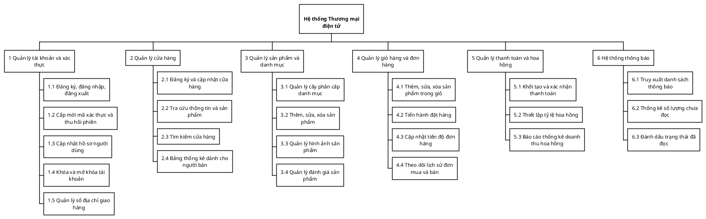
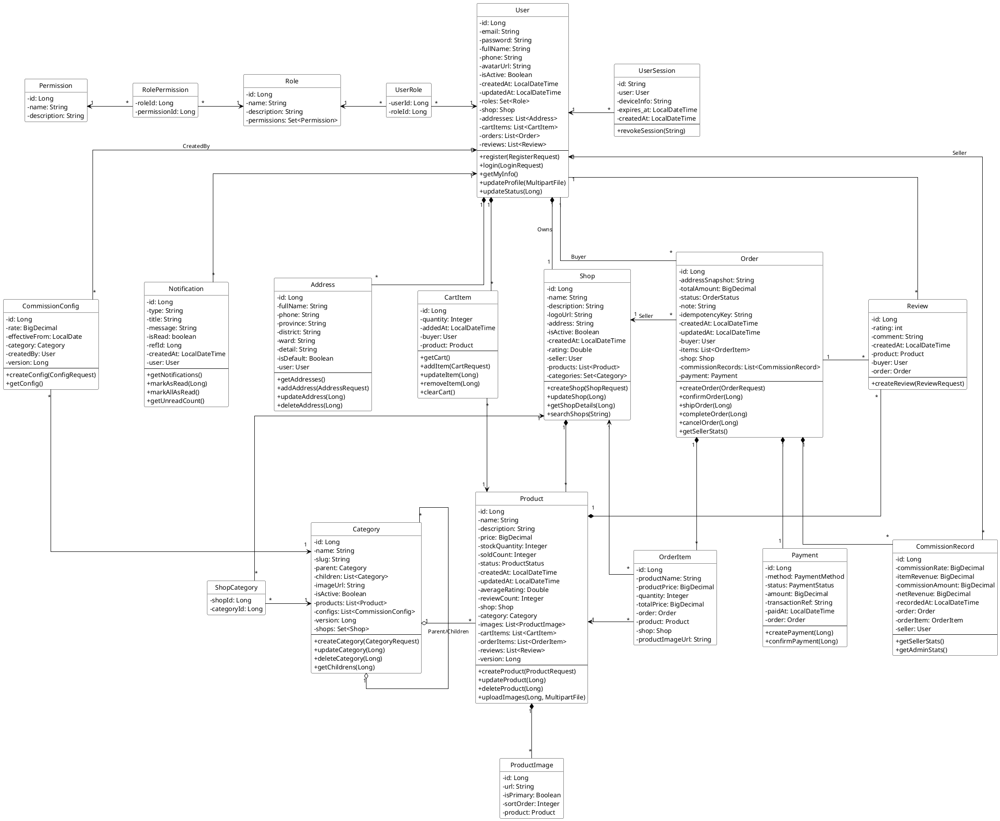

# TÀI LIỆU ĐẶC TẢ YÊU CẦU DỰ ÁN
**Tên đề tài:** Xây dựng Nền tảng Thương mại điện tử (VLT E-Commerce Platform)

---

## I. Giới thiệu chung

### 1. Mục tiêu hệ thống
VLT E-Commerce là nền tảng thương mại điện tử đa người bán (Multi-vendor), kết nối trực tiếp Người mua và Người bán trên cùng một hệ thống. Mục tiêu cốt lõi:
* Cung cấp môi trường mua sắm trực tuyến thuận tiện, an toàn với quy trình đặt hàng và thanh toán khép kín.
* Hỗ trợ người bán tạo lập và quản lý cửa hàng, sản phẩm, và theo dõi doanh thu một cách trực quan.
* Quản lý tự động các khoản hoa hồng, chiết khấu và đối soát minh bạch giữa chủ sàn và người bán.

### 2. Phạm vi dự án
* **Nền tảng triển khai:** Ứng dụng Web (Web Application), thiết kế dạng Single Page Application (React) kết hợp RESTful API Backend.
* **Đối tượng sử dụng:**
  * **Khách vãng lai (Guest):** Tìm kiếm và xem sản phẩm, cửa hàng.
  * **Người mua (Buyer):** Tài khoản đã đăng ký (Thêm giỏ hàng, đặt mua, đánh giá).
  * **Người bán (Seller):** Người mua đã đăng ký nâng cấp mở cửa hàng.
  * **Quản trị viên (Admin):** Quản lý danh mục, tỷ lệ hoa hồng, và giám sát hệ thống.
* **Phạm vi xử lý:** Quản lý tài khoản, cửa hàng, sản phẩm, giỏ hàng, đặt hàng, đánh giá, thông báo realtime, và đối soát hoa hồng.

---

## II. Đặc tả yêu cầu tổng quát

### 1. Người mua (Buyer)
- Có thể đăng ký, đăng nhập và quản lý hồ sơ cá nhân, sổ địa chỉ.
- Tra cứu, tìm kiếm và lọc sản phẩm theo danh mục, từ khóa.
- Quản lý giỏ hàng: Thêm, sửa số lượng, xóa sản phẩm.
- Đặt hàng: Chọn địa chỉ giao hàng, xác nhận giỏ hàng, sử dụng cơ chế chống trùng lặp đơn hàng (Idempotency).
- Theo dõi trạng thái đơn hàng và thanh toán (Momo, VNPay, COD).
- Viết đánh giá, bình luận sản phẩm sau khi mua thành công.
- Nhận thông báo realtime về trạng thái đơn hàng.

### 2. Người bán (Seller)
- Bao gồm toàn bộ quyền của Người mua.
- Có thể đăng ký thông tin mở cửa hàng (Shop).
- Quản lý sản phẩm: Đăng sản phẩm mới, upload nhiều ảnh (Cloudinary), thiết lập giá, kho hàng.
- Xử lý đơn hàng: Tiếp nhận, xác nhận, và cập nhật tiến độ giao hàng.
- Xem thống kê doanh thu và báo cáo hoa hồng đã trừ của sàn.

### 3. Quản trị viên (Admin)
- Quản lý cây danh mục ngành hàng (Category đa cấp).
- Thiết lập cấu hình tỷ lệ hoa hồng (Commission Config) cho từng ngành hàng hoặc mốc thời gian.
- Xem báo cáo tổng quan toàn sàn (Tổng giao dịch, doanh thu hoa hồng).

---

## III. Sơ đồ phân rã chức năng (WBS)

---

## IV. Đặc tả chi tiết các lớp và phương thức (UML Class Diagram)

---

## V. Danh sách thực thể, bộ khóa, thuộc tính

### 1. Thực thể users (Người dùng)
* **Mô tả:** Lưu trữ thông tin tài khoản, hồ sơ và trạng thái hoạt động của người dùng trên hệ thống.
* **Bộ khóa duy nhất (Unique Keys):**
  * **Khóa chính (PK):** id (BIGINT)
  * **Khóa ứng viên (Unique):** email
* **Thuộc tính:**
  * `id` (PK, BIGINT): Mã định danh duy nhất của người dùng.
  * `email` (VARCHAR(100), NOT NULL, UNIQUE): Địa chỉ email dùng để đăng nhập.
  * `password` (VARCHAR(255), NOT NULL): Mật khẩu đã được băm an toàn (bcrypt).
  * `full_name` (VARCHAR(30), NOT NULL): Họ và tên đầy đủ.
  * `phone` (VARCHAR(20), NULL): Số điện thoại liên hệ.
  * `avatar_url` (VARCHAR(500), NULL): Đường dẫn ảnh đại diện.
  * `is_active` (BOOLEAN, DEFAULT TRUE): Trạng thái tài khoản (Đang hoạt động/Bị khóa).
  * `created_at` (TIMESTAMP, NOT NULL): Thời điểm đăng ký.
  * `updated_at` (TIMESTAMP, NOT NULL): Thời điểm cập nhật hồ sơ gần nhất.

### 2. Thực thể roles (Vai trò)
* **Mô tả:** Phân loại vai trò người dùng (Ví dụ: ROLE_BUYER, ROLE_SELLER).
* **Bộ khóa duy nhất:**
  * **Khóa chính (PK):** id (BIGINT)
  * **Khóa ứng viên (Unique):** name
* **Thuộc tính:**
  * `id` (PK, BIGINT): Mã định danh vai trò.
  * `name` (VARCHAR(50), NOT NULL, UNIQUE): Tên vai trò hệ thống.
  * `description` (VARCHAR(255), NULL): Mô tả chi tiết vai trò.

### 3. Thực thể permissions (Quyền hạn)
* **Mô tả:** Định nghĩa các quyền chi tiết tương ứng với các thao tác trên hệ thống.
* **Bộ khóa duy nhất:**
  * **Khóa chính (PK):** id (BIGINT)
  * **Khóa ứng viên (Unique):** name
* **Thuộc tính:**
  * `id` (PK, BIGINT): Mã định danh quyền.
  * `name` (VARCHAR(50), NOT NULL, UNIQUE): Mã quyền hệ thống (vd: CREATE_PRODUCT).
  * `description` (VARCHAR(255), NULL): Mô tả mục đích của quyền.

### 4. Thực thể user_roles (Bảng trung gian User - Role)
* **Mô tả:** Ánh xạ tài khoản người dùng thuộc các vai trò nào.
* **Bộ khóa duy nhất:**
  * **Khóa chính phức hợp (Composite PK):** (user_id, role_id)
* **Thuộc tính:**
  * `user_id` (PK, FK -> users.id): ID người dùng.
  * `role_id` (PK, FK -> roles.id): ID vai trò.

### 5. Thực thể role_permissions (Bảng trung gian Role - Permission)
* **Mô tả:** Ánh xạ vai trò bao gồm những quyền hạn nào.
* **Bộ khóa duy nhất:**
  * **Khóa chính phức hợp (Composite PK):** (role_id, permission_id)
* **Thuộc tính:**
  * `role_id` (PK, FK -> roles.id): ID vai trò.
  * `permission_id` (PK, FK -> permissions.id): ID quyền hạn.

### 6. Thực thể user_sessions (Phiên đăng nhập)
* **Mô tả:** Quản lý các phiên đăng nhập (refresh token) để hỗ trợ thu hồi quyền truy cập.
* **Bộ khóa duy nhất:**
  * **Khóa chính (PK):** id (VARCHAR)
* **Thuộc tính:**
  * `id` (PK, VARCHAR(255)): Mã token ID hoặc session ID.
  * `device_info` (VARCHAR(255), NULL): Thông tin thiết bị đăng nhập.
  * `expires_at` (TIMESTAMP, NOT NULL): Thời điểm hết hạn của phiên.
  * `created_at` (TIMESTAMP, NOT NULL): Thời điểm bắt đầu phiên.
  * `user_id` (FK -> users.id, NOT NULL): Người dùng sở hữu phiên.

### 7. Thực thể addresses (Sổ địa chỉ)
* **Mô tả:** Lưu trữ danh sách địa chỉ nhận hàng của người mua.
* **Bộ khóa duy nhất:**
  * **Khóa chính (PK):** id (BIGINT)
* **Thuộc tính:**
  * `id` (PK, BIGINT): Định danh địa chỉ.
  * `full_name` (VARCHAR(50), NOT NULL): Tên người nhận.
  * `phone` (VARCHAR(20), NOT NULL): Số điện thoại nhận hàng.
  * `province`, `district`, `ward` (VARCHAR(50), NOT NULL): Thông tin Tỉnh/Thành, Quận/Huyện, Phường/Xã.
  * `detail` (VARCHAR(200), NOT NULL): Số nhà, tên đường.
  * `is_default` (BOOLEAN, DEFAULT FALSE): Đánh dấu địa chỉ mặc định.
  * `user_id` (FK -> users.id, NOT NULL): Thuộc về người dùng nào.

### 8. Thực thể shops (Cửa hàng)
* **Mô tả:** Thông tin cửa hàng của người bán trên hệ thống.
* **Bộ khóa duy nhất:**
  * **Khóa chính (PK):** id (BIGINT)
  * **Khóa ứng viên (Unique):** seller_id
* **Thuộc tính:**
  * `id` (PK, BIGINT): Mã định danh cửa hàng.
  * `name` (VARCHAR(100), NOT NULL): Tên cửa hàng.
  * `description` (TEXT, NULL): Mô tả cửa hàng.
  * `logo_url` (VARCHAR(500), NULL): Ảnh logo cửa hàng.
  * `address` (VARCHAR(200), NULL): Địa chỉ kinh doanh.
  * `is_active` (BOOLEAN, DEFAULT TRUE): Trạng thái cửa hàng.
  * `rating` (DOUBLE, DEFAULT 0.0): Điểm đánh giá trung bình.
  * `created_at` (TIMESTAMP, NOT NULL): Ngày tạo.
  * `seller_id` (FK -> users.id, NOT NULL, UNIQUE): Tài khoản chủ cửa hàng.

### 9. Thực thể categories (Danh mục)
* **Mô tả:** Hệ thống phân cấp danh mục ngành hàng.
* **Bộ khóa duy nhất:**
  * **Khóa chính (PK):** id (BIGINT)
  * **Khóa ứng viên (Unique):** slug
* **Thuộc tính:**
  * `id` (PK, BIGINT): Mã danh mục.
  * `name` (VARCHAR(100), NOT NULL): Tên danh mục.
  * `slug` (VARCHAR(100), NOT NULL, UNIQUE): Định danh URL an toàn.
  * `image_url` (VARCHAR(500), NULL): Ảnh minh họa danh mục.
  * `is_active` (BOOLEAN, DEFAULT TRUE): Đang hiển thị hay không.
  * `version` (BIGINT): Quản lý concurrency (Pessimistic/Optimistic lock).
  * `parent_id` (FK -> categories.id, NULL): Danh mục cha.

### 10. Thực thể shop_categories (Bảng trung gian Shop - Category)
* **Mô tả:** Lưu trữ danh sách các ngành hàng mà cửa hàng đang đăng ký kinh doanh.
* **Bộ khóa duy nhất:**
  * **Khóa chính phức hợp (Composite PK):** (shop_id, category_id)
* **Thuộc tính:**
  * `shop_id` (PK, FK -> shops.id): ID cửa hàng.
  * `category_id` (PK, FK -> categories.id): ID ngành hàng.

### 11. Thực thể products (Sản phẩm)
* **Mô tả:** Quản lý thông tin chi tiết về sản phẩm đăng bán.
* **Bộ khóa duy nhất:**
  * **Khóa chính (PK):** id (BIGINT)
* **Thuộc tính:**
  * `id` (PK, BIGINT): Mã sản phẩm.
  * `name` (VARCHAR(200), NOT NULL): Tên sản phẩm.
  * `description` (TEXT): Mô tả chi tiết.
  * `price` (DECIMAL(15,2), NOT NULL): Giá bán.
  * `stock_quantity` (INT, NOT NULL): Số lượng tồn kho.
  * `sold_count` (INT, DEFAULT 0): Số lượng đã bán.
  * `status` (VARCHAR(20), NOT NULL): Trạng thái (ACTIVE, HIDDEN...).
  * `average_rating` (DOUBLE, DEFAULT 0.0): Điểm đánh giá trung bình.
  * `review_count` (INT, DEFAULT 0): Số lượng đánh giá.
  * `version` (BIGINT): Quản lý lock khi trừ tồn kho.
  * `created_at`, `updated_at` (TIMESTAMP): Dấu vết thời gian.
  * `shop_id` (FK -> shops.id, NOT NULL): Cửa hàng phân phối.
  * `category_id` (FK -> categories.id, NOT NULL): Ngành hàng.

### 12. Thực thể product_images (Ảnh sản phẩm)
* **Mô tả:** Album ảnh minh họa cho sản phẩm.
* **Bộ khóa duy nhất:**
  * **Khóa chính (PK):** id (BIGINT)
* **Thuộc tính:**
  * `id` (PK, BIGINT): Mã ảnh.
  * `url` (VARCHAR(200), NOT NULL): Đường dẫn lưu trữ.
  * `is_primary` (BOOLEAN, DEFAULT FALSE): Ảnh đại diện chính.
  * `sort_order` (INT, DEFAULT 0): Vị trí sắp xếp.
  * `product_id` (FK -> products.id, NOT NULL): Thuộc sản phẩm nào.

### 13. Thực thể cart_items (Giỏ hàng)
* **Mô tả:** Các sản phẩm khách hàng đang thêm vào giỏ.
* **Bộ khóa duy nhất:**
  * **Khóa chính (PK):** id (BIGINT)
* **Thuộc tính:**
  * `id` (PK, BIGINT): Mã giỏ hàng.
  * `quantity` (INT, NOT NULL): Số lượng chọn mua.
  * `added_at` (TIMESTAMP, NOT NULL): Thời điểm thêm vào giỏ.
  * `buyer_id` (FK -> users.id, NOT NULL): Của người mua nào.
  * `product_id` (FK -> products.id, NOT NULL): Sản phẩm nào.

### 14. Thực thể orders (Đơn hàng)
* **Mô tả:** Lưu trữ thông tin đơn hàng đã đặt.
* **Bộ khóa duy nhất:**
  * **Khóa chính (PK):** id (BIGINT)
  * **Khóa ứng viên (Unique):** idempotency_key
* **Thuộc tính:**
  * `id` (PK, BIGINT): Mã đơn hàng.
  * `address_snapshot` (TEXT, NOT NULL): Lưu lại bản cứng của địa chỉ tại thời điểm đặt.
  * `total_amount` (DECIMAL(15,2), NOT NULL): Tổng tiền thanh toán.
  * `status` (VARCHAR(20), NOT NULL): Trạng thái đơn (PENDING, SHIPPING, COMPLETED...).
  * `note` (VARCHAR(500), NULL): Ghi chú của khách.
  * `idempotency_key` (VARCHAR(100), UNIQUE): Key chống trùng lặp đơn hàng.
  * `created_at`, `updated_at` (TIMESTAMP): Dấu vết thời gian.
  * `buyer_id` (FK -> users.id, NOT NULL): Người đặt hàng.
  * `shop_id` (FK -> shops.id, NOT NULL): Cửa hàng cung cấp.

### 15. Thực thể order_items (Chi tiết đơn hàng)
* **Mô tả:** Lưu lại bản cứng thông tin các sản phẩm tại thời điểm chốt đơn.
* **Bộ khóa duy nhất:**
  * **Khóa chính (PK):** id (BIGINT)
* **Thuộc tính:**
  * `id` (PK, BIGINT): Mã chi tiết đơn.
  * `product_name` (VARCHAR(500), NOT NULL): Tên sản phẩm khi mua.
  * `product_price` (DECIMAL(15,2), NOT NULL): Giá chốt khi mua.
  * `quantity` (INT, NOT NULL): Số lượng.
  * `total_price` (DECIMAL(15,2), NOT NULL): Thành tiền.
  * `product_image_url` (VARCHAR(500)): Ảnh tại thời điểm mua.
  * `order_id` (FK -> orders.id, NOT NULL): Thuộc đơn hàng nào.
  * `product_id` (FK -> products.id, NOT NULL): Tham chiếu sản phẩm gốc.
  * `shop_id` (FK -> shops.id, NOT NULL): Tham chiếu cửa hàng.

### 16. Thực thể payments (Thanh toán)
* **Mô tả:** Quản lý giao dịch thanh toán cho đơn hàng.
* **Bộ khóa duy nhất:**
  * **Khóa chính (PK):** id (BIGINT)
  * **Khóa ứng viên (Unique):** order_id
* **Thuộc tính:**
  * `id` (PK, BIGINT): Mã giao dịch thanh toán nội bộ.
  * `method` (VARCHAR(20), NOT NULL): Phương thức (COD, VNPay...).
  * `status` (VARCHAR(20), NOT NULL): Trạng thái (PENDING, SUCCESS...).
  * `amount` (DECIMAL(15,2), NOT NULL): Số tiền giao dịch.
  * `transaction_ref` (VARCHAR(200), NULL): Mã giao dịch từ cổng thanh toán.
  * `paid_at` (TIMESTAMP, NULL): Thời điểm thanh toán thành công.
  * `order_id` (FK -> orders.id, NOT NULL, UNIQUE): Ánh xạ 1-1 với đơn hàng.

### 17. Thực thể reviews (Đánh giá)
* **Mô tả:** Phản hồi của người mua về sản phẩm sau khi hoàn tất đơn.
* **Bộ khóa duy nhất:**
  * **Khóa chính (PK):** id (BIGINT)
* **Thuộc tính:**
  * `id` (PK, BIGINT): Mã đánh giá.
  * `rating` (INT, NOT NULL): Số sao (1 đến 5).
  * `comment` (TEXT): Nội dung bình luận.
  * `created_at` (TIMESTAMP, NOT NULL): Thời gian gửi đánh giá.
  * `product_id` (FK -> products.id, NOT NULL): Sản phẩm được đánh giá.
  * `buyer_id` (FK -> users.id, NOT NULL): Người viết đánh giá.
  * `order_id` (FK -> orders.id, NOT NULL): Đánh giá cho đơn hàng nào.

### 18. Thực thể notifications (Thông báo)
* **Mô tả:** Hệ thống thông báo in-app realtime cho người dùng.
* **Bộ khóa duy nhất:**
  * **Khóa chính (PK):** id (BIGINT)
* **Thuộc tính:**
  * `id` (PK, BIGINT): Mã thông báo.
  * `type` (VARCHAR(50), NOT NULL): Loại thông báo (ORDER_STATUS...).
  * `title` (VARCHAR(200), NOT NULL): Tiêu đề thông báo.
  * `message` (TEXT, NOT NULL): Nội dung chi tiết.
  * `is_read` (BOOLEAN, NOT NULL): Trạng thái đã đọc.
  * `ref_id` (BIGINT): ID tham chiếu tới thực thể liên quan.
  * `created_at` (TIMESTAMP, NOT NULL): Thời điểm báo.
  * `user_id` (FK -> users.id, NOT NULL): Người nhận.

### 19. Thực thể commission_configs (Cấu hình hoa hồng)
* **Mô tả:** Thiết lập tỷ lệ chiết khấu sàn thu của Seller theo từng ngành hàng.
* **Bộ khóa duy nhất:**
  * **Khóa chính (PK):** id (BIGINT)
* **Thuộc tính:**
  * `id` (PK, BIGINT): Mã cấu hình.
  * `rate` (DECIMAL(5,4), NOT NULL): Tỷ lệ phần trăm.
  * `effective_from` (DATE, NOT NULL): Ngày bắt đầu áp dụng.
  * `version` (BIGINT): Quản lý lock.
  * `category_id` (FK -> categories.id, NOT NULL): Áp dụng cho ngành hàng nào.
  * `created_by` (FK -> users.id, NOT NULL): Quản trị viên nào thiết lập.

### 20. Thực thể commission_records (Hồ sơ hoa hồng)
* **Mô tả:** Bản ghi đối soát số tiền hoa hồng mà sàn đã thu.
* **Bộ khóa duy nhất:**
  * **Khóa chính (PK):** id (BIGINT)
  * **Khóa ứng viên (Unique):** order_item_id
* **Thuộc tính:**
  * `id` (PK, BIGINT): Mã bản ghi đối soát.
  * `commission_rate` (DECIMAL(5,4), NOT NULL): Tỷ lệ thu tại thời điểm chốt đơn.
  * `item_revenue` (DECIMAL(15,2), NOT NULL): Doanh thu của mặt hàng.
  * `commission_amount` (DECIMAL(15,2), NOT NULL): Tiền phí sàn giữ lại.
  * `net_revenue` (DECIMAL(15,2), NOT NULL): Tiền thực nhận của Seller.
  * `recorded_at` (TIMESTAMP, NOT NULL): Thời điểm chốt sổ.
  * `order_id` (FK -> orders.id, NOT NULL): Thuộc đơn nào.
  * `order_item_id` (FK -> order_items.id, NOT NULL, UNIQUE): Thuộc mặt hàng nào (1-1).
  * `seller_id` (FK -> users.id, NOT NULL): Shop bị thu phí.

---

## VI. Quan hệ giữa các thực thể (Cascade Rules)

1. **User – 1 : N – Shop:** Một người dùng có thể mở 1 cửa hàng. `ON DELETE CASCADE`.
2. **User – 1 : N – Address:** `ON DELETE CASCADE` (Xóa tài khoản thì xóa hết địa chỉ).
3. **User – 1 : N – CartItem:** `ON DELETE CASCADE`.
4. **Shop – 1 : N – Product:** `ON DELETE CASCADE` (Xóa shop thì mất hết sản phẩm).
5. **Product – 1 : N – ProductImage:** `ON DELETE CASCADE`.
6. **Order – 1 : N – OrderItem:** `ON DELETE CASCADE`.
7. **Order – 1 : 1 – Payment:** `ON DELETE CASCADE`.
8. **Product – 1 : N – Review:** `ON DELETE CASCADE`.
9. **User – 1 : N – Order:** `ON DELETE RESTRICT` (Để bảo toàn lịch sử mua hàng, hệ thống không cho phép xóa tài khoản nếu họ đã có đơn hàng; chỉ được đổi `is_active` = false).

---

## VII. Các ràng buộc toàn vẹn

### 1. Ràng buộc miền giá trị (Check Constraints)
* **Đánh giá sản phẩm:**
  `CHECK (rating BETWEEN 1 AND 5)`
* **Số lượng hàng hóa:**
  `CHECK (stock_quantity >= 0)`
  `CHECK (quantity > 0)` (Trong chi tiết đơn hàng / Giỏ hàng)
* **Tiền tệ:**
  `CHECK (price >= 0 AND total_amount >= 0 AND amount >= 0)`
* **Trạng thái đơn hàng:**
  `CHECK (status IN ('PENDING', 'CONFIRMED', 'SHIPPING', 'COMPLETED', 'CANCELLED'))`

### 2. Ràng buộc duy nhất có điều kiện (Unique Indexes)
* **Chống tạo trùng đơn hàng mạng chập chờn (Idempotency):**
  `CREATE UNIQUE INDEX uq_order_idempotency ON orders(idempotency_key) WHERE idempotency_key IS NOT NULL;`
* **Đảm bảo tính duy nhất 1 mặt hàng chỉ đối soát hoa hồng 1 lần:**
  `CREATE UNIQUE INDEX uq_commission_order_item ON commission_records(order_item_id);`

### 3. Ràng buộc cấp ứng dụng (Application Level / Locking)
* **Chống trừ âm kho hàng (Race Condition):**
  Lệnh trừ kho phải đảm bảo cơ chế Atomic: `UPDATE products SET stock_quantity = stock_quantity - ? WHERE id = ? AND stock_quantity >= ?`
* **Tránh tính hoa hồng 2 lần (Pessimistic Lock):**
  Sử dụng `@Lock(LockModeType.PESSIMISTIC_WRITE)` trên bản ghi `Order` tại thời điểm thay đổi trạng thái sang `COMPLETED`.
