# Đặc Tả Yêu Cầu Dự Án Ecommerce (Sàn Thương Mại Điện Tử)

## I. Giới thiệu chung

### 1. Mục tiêu hệ thống
Hệ thống Ecommerce là một nền tảng Sàn thương mại điện tử đa người bán (Multi-vendor E-commerce Platform) cho phép các cá nhân và doanh nghiệp mở gian hàng trực tuyến để tiếp cận khách hàng. Mục tiêu cốt lõi:
- Cung cấp môi trường mua bán trực tuyến an toàn, nhanh chóng và minh bạch giữa Người Mua (Buyer) và Người Bán (Seller).
- Hệ thống hỗ trợ người bán đăng tải sản phẩm, quản lý kho hàng và xử lý đơn đặt hàng tự động.
- Mang lại nguồn thu cho nền tảng (Sàn) thông qua cơ chế thu phí hoa hồng (Commission) trên từng danh mục sản phẩm từ các đơn hàng giao dịch thành công.

### 2. Phạm vi dự án
- **Nền tảng triển khai:** Ứng dụng Web (Web Application), tối ưu hiển thị cho Desktop và Mobile, sử dụng React (Vite) ở Frontend và Spring Boot ở Backend.
- **Đối tượng sử dụng:** Khách vãng lai (Guest), Người mua (Buyer), Người bán (Seller), và Quản trị viên (Admin).
- **Phạm vi xử lý:**
  - Xác thực người dùng bằng JWT, quản lý tài khoản và khóa tài khoản vi phạm.
  - Mở gian hàng (Shop), đăng tải sản phẩm với đa dạng hình ảnh (lưu trữ qua Cloudinary) và danh mục (Category).
  - Quản lý Giỏ hàng (Cart) và Đơn hàng (Order) với quy trình trạng thái rõ ràng (Pending, Confirmed, Shipping, Completed, Cancelled).
  - Quản lý Đánh giá (Review) sản phẩm có kèm hình ảnh thực tế sau khi mua hàng.
  - Hệ thống thu phí hoa hồng tự động theo cấu hình % của Sàn dành cho từng danh mục hàng hóa.
- **Ngoài phạm vi:**
  - Tích hợp cổng thanh toán trực tuyến thực tế (hiện tại xử lý theo dạng ví/điểm mô phỏng hoặc COD).
  - Đăng nhập qua mạng xã hội (Social Login).
  - Chat trực tiếp theo thời gian thực (Real-time chat) giữa người mua và người bán.

---

## II. Đặc tả yêu cầu tổng quát

### 1. Người dùng thông thường (Khách & Người Mua - Buyer)
- Có thể đăng ký và đăng nhập bằng email/mật khẩu.
- Có thể xem danh sách sản phẩm, lọc theo danh mục, xem chi tiết sản phẩm.
- Có thể thêm sản phẩm vào giỏ hàng, quản lý số lượng và tiến hành đặt hàng.
- Có thể xem lịch sử đơn hàng của mình và theo dõi trạng thái đơn.
- Có quyền đánh giá (Review) và đính kèm ảnh cho các sản phẩm đã mua thành công.

### 2. Người Bán (Seller)
- Có tất cả quyền hạn của Người Mua.
- Có thể đăng ký mở gian hàng (Shop) và quản lý hồ sơ Shop.
- Có thể Thêm, Sửa, Xóa (ẩn) sản phẩm, thiết lập giá bán và số lượng tồn kho.
- Có thể xem và quản lý các đơn đặt hàng từ khách, cập nhật trạng thái đơn hàng (Xác nhận, Đang giao, Đã giao...).
- Có thể theo dõi thống kê doanh thu thu về (Net) sau khi đã trừ phí hoa hồng cho Sàn.

### 3. Quản trị viên (Admin)
- Đăng nhập vào trang quản trị (Admin Dashboard) riêng biệt.
- **Quản lý người dùng:** Xem danh sách, tìm kiếm và có quyền Khóa/Mở khóa (Ban/Unban) tài khoản của những người dùng vi phạm.
- **Cấu hình Sàn:** Điều chỉnh và thiết lập tỷ lệ phí hoa hồng (Commission Rate) theo từng danh mục hàng hóa.
- **Thống kê tổng quan:** Xem báo cáo doanh thu tổng của toàn sàn và mức hoa hồng thu được.

---

## III. Phân rã chức năng chi tiết

```plantuml
@startwbs
* Hệ thống Ecommerce
** 1. Xác thực & Quản lý Tài khoản (Auth & Users)
*** Đăng ký / Đăng nhập / Đăng xuất
*** Làm mới Token (Refresh) & Thu hồi phiên đăng nhập
*** Xem & Cập nhật hồ sơ cá nhân (Me)
*** Quản lý Địa chỉ giao hàng (Addresses)
*** Quản trị viên Khóa/Mở khóa tài khoản
** 2. Gian hàng & Danh mục (Shops & Categories)
*** Đăng ký & Quản lý thông tin Shop
*** Tìm kiếm Shop & Xem sản phẩm của Shop
*** Quản lý Danh mục phân cấp (Cha - Con)
** 3. Quản lý Sản phẩm (Products)
*** Thêm mới, Cập nhật, Xóa (Ẩn) sản phẩm
*** Đăng tải và quản lý hình ảnh (Cloudinary)
*** Lấy chi tiết sản phẩm & Đánh giá
*** Quản lý kho hàng của Seller
** 4. Giỏ hàng & Đơn hàng (Cart & Orders)
*** Thêm, Sửa số lượng, Xóa sản phẩm trong Giỏ
*** Thanh toán giỏ hàng & Tạo đơn hàng (Checkout)
*** Cập nhật trạng thái: Xác nhận, Giao hàng, Hoàn tất, Hủy
*** Xem lịch sử đơn hàng (Buyer) & Quản lý đơn (Seller)
** 5. Thanh toán (Payments)
*** Khởi tạo giao dịch thanh toán
*** Xác nhận thanh toán thành công
** 6. Đánh giá & Thông báo (Reviews & Notifications)
*** Viết đánh giá & Đính kèm ảnh (Chấm điểm 1-5 sao)
*** Nhận thông báo hệ thống (Đơn hàng, Hệ thống)
*** Đánh dấu Đã đọc / Chưa đọc thông báo
** 7. Cấu hình Hoa hồng & Thống kê (Commission & Dashboard)
*** Thiết lập tỷ lệ % Hoa hồng theo Danh mục
*** Thống kê Hoa hồng cho Admin (Tổng thu)
*** Thống kê Hoa hồng & Doanh thu thực nhận cho Seller
*** Báo cáo tổng quan Dashboard Seller
@endwbs
```

### 1. Xác thực & Tài khoản
- Quản lý đăng ký, đăng nhập bằng email, mã hóa mật khẩu bằng BCrypt.
- Xác thực và phân quyền bằng JWT. Lưu trữ phiên đăng nhập (UserSession) trong Database để hỗ trợ thu hồi Token từ xa (Blacklist Redis).
- Chặn đăng nhập và chặn gọi API ngay lập tức khi tài khoản bị Admin chuyển trạng thái `isActive = false`.

### 2. Quản lý Gian hàng (Shop) & Danh mục
- Người dùng có thể nâng cấp thành Seller bằng cách mở Shop.
- Sàn cung cấp hệ thống phân cấp Danh mục (Category) từ cha đến con. Người bán buộc phải gắn sản phẩm vào các danh mục hợp lệ.

### 3. Quản lý Sản phẩm (Product)
- Người bán có quyền đăng tải sản phẩm kèm Tên, Mô tả, Giá tiền, Số lượng tồn kho và Danh mục.
- Cho phép đính kèm nhiều hình ảnh minh họa (Product Images) thông qua hệ thống lưu trữ Cloudinary.
- **Quy tắc:** Khi sản phẩm được tạo hoặc sửa đổi số lượng tồn kho (Stock), hệ thống tự động kiểm tra để tránh bán vượt mức tồn kho (Out of Stock).

### 4. Đặt hàng & Giỏ hàng
- Hỗ trợ giỏ hàng lưu trữ nhiều sản phẩm từ các Shop khác nhau.
- Tính toán tổng tiền chính xác.
- Tạo Đơn hàng (Order) và các chi tiết đơn (OrderItems). 
- **Quy tắc:** Một đơn hàng có một vòng đời khép kín. Người bán có trách nhiệm đẩy trạng thái tiến lên, người mua có quyền Hủy (Cancel) nếu đơn chưa được xác nhận.

### 5. Đánh giá (Review)
- Cho phép người mua để lại 1 lượt đánh giá (Rating 1-5 sao) và nhận xét (Comment) kèm hình ảnh cho mỗi sản phẩm thuộc một đơn hàng đã hoàn tất (Completed).
- **Quy tắc:** Chủ shop không thể tự mua và đánh giá sản phẩm của chính mình. Không cho phép đánh giá lặp lại trên cùng một mặt hàng trong một đơn.

### 6. Quản lý Hoa hồng & Cấu hình Sàn
- Admin thiết lập mức phí % hoa hồng áp dụng dựa trên Category và Ngày có hiệu lực (Effective Date).
- Khi đơn hàng hoàn tất, hệ thống tự động chốt doanh thu và trích một phần tiền (Gross * Rate) thành doanh thu của Sàn (Commission), phần còn lại trả về cho Shop (Net).

### 7. Báo cáo & Thống kê
- Cung cấp số liệu thống kê trực quan cho Seller (Tổng số đơn, Tổng doanh thu, Số tiền bị trừ phí).
- Cung cấp trang Admin Dashboard thống kê sức khỏe của Sàn (Số tài khoản, Tổng giao dịch, Lợi nhuận ròng của Sàn).
